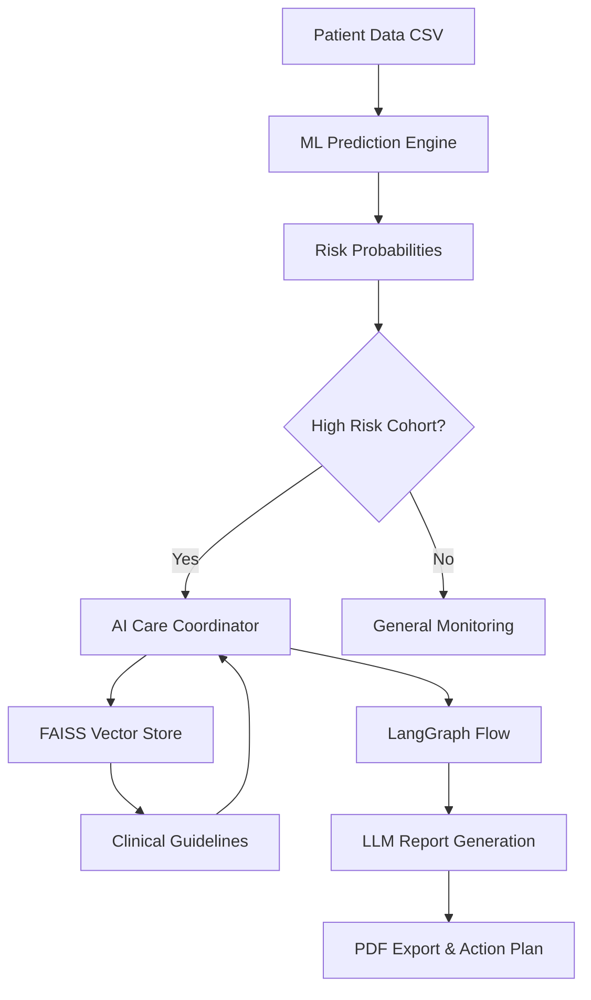

# 🏥 Clinical Appointment No-Show Predictor & Agentic Care Coordinator

[](https://www.python.org/downloads/)
[](https://streamlit.io/)
[](https://langchain-ai.github.io/langgraph/)

A premium, end-to-end solution for predicting clinical appointment no-shows and coordinating preventative care. Leveraging XGBoost for ML predictions and a LangGraph-powered RAG agent for evidence-based interventions.

---

## 🎨 System Overview

This application bridges the gap between raw predictive analytics and clinical action. It features a dual-engine architecture:

1.  **ML Engine:** Uses a high-performance XGBoost model to analyze patient demographics, appointment lead times, and historical behavior to calculate a precise "No-Show" risk probability.
2.  **RAG Agent Engine:** A multi-step autonomous agent built with **LangGraph** that retrieves relevant clinical guidelines from a **FAISS** vector store to generate personalized care coordination plans.

---

## 🛠 Features

### 📊 Intelligent ML Predictions
- **Real-time Batch Processing:** Upload CSV records and receive instant risk scores.
- **Risk Categorization:** Patients are automatically grouped into **High**, **Medium**, and **Low** risk categories.
- **Dynamic Charts:** Interactive visualizations using Altair showing risk distribution and key feature drivers (age, lead time, SMS verification).

### 🤖 Agentic Care Coordinator
- **RAG-Powered Insights:** Contextual analysis using official clinical guidelines stored in a semantic vector database.
- **Automated Reporting:** Generates structured PDF reports containing:
    - Executive risk summaries.
    - Identification of key contributing factors (e.g., social determinants, lead time).
    - Multi-priority intervention strategies.
- **Powered by Groq:** High-speed inference using `llama-3.1-8b-instant`.

---

## 🏗 High-Level Architecture



---

## 🚀 Installation & Setup

### 1. Project Initialization
```bash
git clone https://github.com/Imposon/Clinical_No_show.git
cd Clinical_No_show
python3 -m venv venv
source venv/bin/activate  # venv\Scripts\activate on Windows
pip install -r requirements.txt
```

### 2. Environment Configuration
Create a `.env` file or Streamlit secrets with your Groq API key:
```env
GROQ_API_KEY=your_api_key_here
```

### 3. Build Guidelines Index
Execute the indexing script to prepare the FAISS vector database:
```bash
python build_faiss_index.py
```

### 4. Launch Dashboard
```bash
streamlit run app.py
```

---

## 📋 Technology Stack
- **Frontend:** Streamlit (Multi-tab structure)
- **Machine Learning:** Scikit-Learn, XGBoost, Joblib
- **AI Agent:** LangGraph, LangChain
- **Vector Database:** FAISS
- **Report Generation:** FPDF2
- **Analytics:** Pandas, Altair, Plotly

---

## 🤝 Team Contribution - Milestone 2
- **Aditya:** Lead Developer, Agent Architecture (LangGraph), Multi-tab UI.
- **Ayush:** RAG Specialist, FAISS Integration, Data Validation.
- **Vedansha:** Frontend Analyst, Interactive Visualizations.
- **Shekhar:** Performance Optimization, Documentation & System Benchmarking.

---
*Created for Clinical Efficiency & Patient Access Improvement.*
